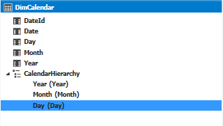
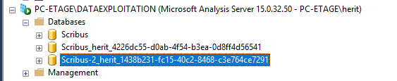

# Analysis Part of the project

## OLAP and model creation

In SSAS (SQL Server Analysis Services), you have two main options for creating a model: Tabular and Multidimensional. For this project, we opted for the Tabular (DAX) because it is more modern, easier to use, and can be integrated with Power BI (which is not possible with Multidimensional).

Tools used:

- Visual Studio 2022 with SQL Server Data Tools (SSDT) extension
- SQL Server Analysis Services (SSAS)

### Steps to create the Tabular model

**Create a new Tabular project** in Visual Studio.

**Connect to the data source** (the data warehouse created in the previous part).

**Import tables and define relationships** to build the data model.

In order to calculate some measure, we had to modifiy some realtion to define which need to be active or inactive.

**Create calculated columns and measures** using DAX to enhance the model.

DAX calculated columns

Number of bugs:= DISTINCTCOUNT(FactBug[BugId])

Fixed bugs:= CALCULATE(
[Number of bugs],
USERELATIONSHIP(FactBug[ResolutionId], DimStatus[StatusId]),
DimStatus[StatusName] IN {"fixed"})

Open bugs:= CALCULATE(
[Number of bugs] - [Fixed bugs], FactBug[IsCurrent] = TRUE())

Reopenend bugs:= CALCULATE(
[Number of bugs],
FactBug[IsCurrent] = TRUE(),
USERELATIONSHIP(FactBug[ResolutionId], DimStatus[StatusId]),
DimStatus[StatusName] IN {"reopened"})

Fixed bugs per vesion:=
CALCULATE(
[Number of bugs],
USERELATIONSHIP(FactBug[VersionFixedId], DimVersion[VersionId]),
DimVersion[VersionName] <> "Unknown" // Exclut les bugs non corrigés
)

Fixed bugs per assignee:=
CALCULATE(
[Number of bugs],
USERELATIONSHIP(FactBug[ResolutionId], DimStatus[StatusId]),
USERELATIONSHIP(FactBug[AssigneeId], DimUser[UserId]),
DimStatus[StatusName] IN {"fixed"}
)

**Create hierarchies and perspectives** to improve data navigation.

Calendar hierarchy

OS hierarchy

**Deploy the model** to the SSAS server for use in reporting tools like Power BI.

