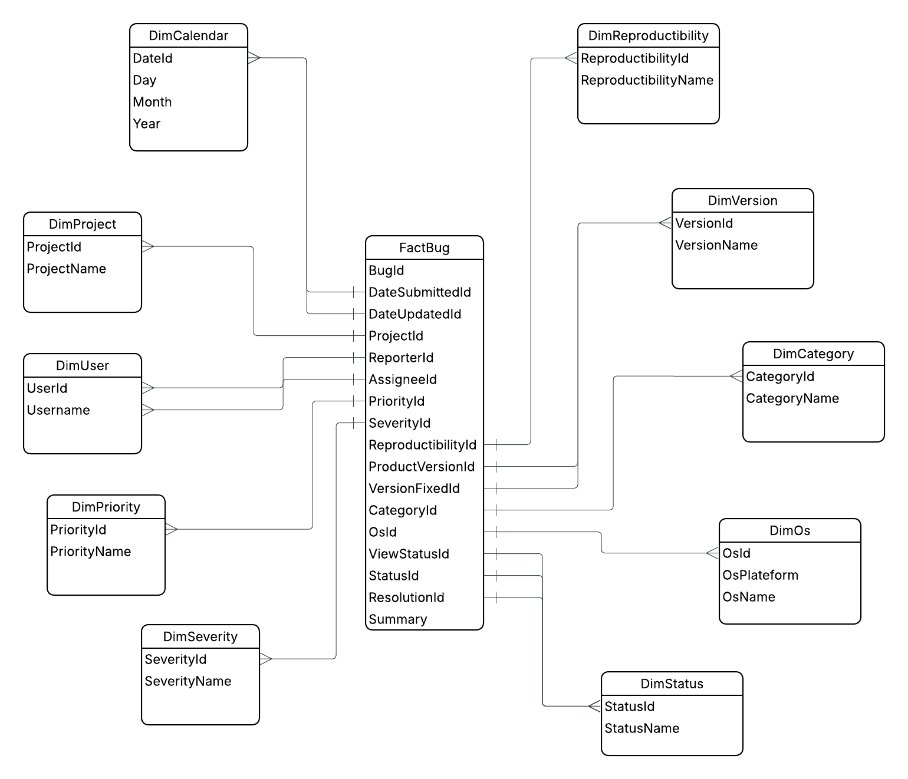
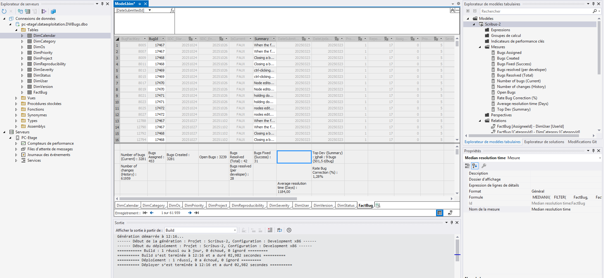
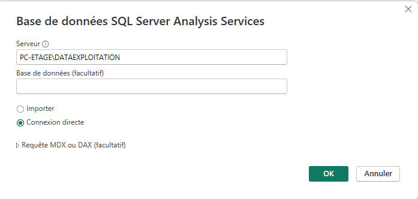
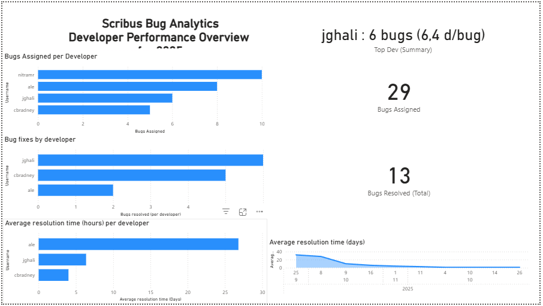

# Documentation du projet

## Construction d’un Data Warehouse et d’un modèle OLAP pour l’analyse du bugtracker Scribus

## 1. Introduction

Ce projet a été réalisé dans le cadre du module 62-62 Data Exploitation. Son objectif était de construire un système décisionnel complet permettant d’analyser les données issues du bugtracker Scribus. Nous avons dû mettre en œuvre les différentes étapes d’un processus décisionnel moderne :

1. extraction et traitement automatique des snapshots CSV publiés hebdomadairement,
2. conception et alimentation d’un Data Warehouse basé sur un modèle en étoile,
3. gestion de l’historisation (SCD Type 2) dans la table de faits,
4. création d’un modèle OLAP Tabular avec SSAS,
5. développement de mesures analytiques en DAX,
6. préparation d’un modèle exploitable dans des outils tels que Power BI ou Excel.

---

## 2. Objectifs du projet

Les objectifs principaux étaient les suivants :

- comprendre et structurer les données du bugtracker Scribus,
- créer un schéma en étoile adapté aux besoins analytiques,
- développer un pipeline ETL automatisé en Python,
- gérer les dimensions en SCD Type 1 et la table de faits en SCD Type 2,
- construire un modèle Tabular dans SSAS basé sur le DWH produit,
- permettre l’analyse détaillée et multidimensionnelle de l’évolution des bugs.

Le système développé devait permettre de répondre à un ensemble de questions analytiques, notamment :

- évolution du nombre de bugs dans le temps,
- performance des développeurs,
- qualité des différentes versions du logiciel,
- répartition des bugs selon les modules,
- analyse de la reproductibilité et des environnements d’exécution.

---

## 3. Architecture globale du système

Le système complet repose sur une architecture classique de Business Intelligence composée de trois couches : Extraction, Transformation et Chargement. Pour ce projet, nous avons développé un pipeline ETL en Python qui automatise l’ensemble du processus. Le code source est disponible dans le répertoire `etl_pipeline`, ainsi que le script SQL DDL pour la création du Data Warehouse.

### 3.1 Extraction

Les snapshots Scribus sont publiés sous forme de fichiers CSV accessibles depuis un répertoire web. Notre pipeline automatise leur récupération :

- il se connecte à la page listant les CSV,
- identifie les nouveaux fichiers en comparant avec le dossier local,
- télécharge uniquement les fichiers manquants,
- les sauvegarde dans un répertoire dédié.

Afin d'automatiser le processus, nous avons configuré un job "cron" sur un serveur Linux pour exécuter le script ETL chaque semaine.

La structure d'un cron est la suivante :

```* * * * *  commande à exécuter
- - - - - -
| | | | | | |
| | | | +---- Jour de la semaine (0 - 7) (Dimanche=0 ou 7)
| | | +------ Mois (1 - 12)
| | +-------- Jour du mois (1 - 31)
| +---------- Heure (0 - 23)
+------------ Minute (0 - 59)
```

Voici le cron qui exécute le script tous les lundis à 8h du matin sur notre serveur :

```
0 8 * * 1 /home/tottino/Documents/HESProjects/BI--CC/etl_pipeline/etl_pipeline.py
```

#### 3.1.1 Téléchargement et lecture des fichiers

`get_csv_from_url(URL, file_path='./data/')`

1. Télécharge le HTML de la page `URL`.
2. Analyse le contenu avec BeautifulSoup pour trouver les liens vers les fichiers CSV du bugtracker.
3. Filtre les liens pour ne garder que les fichiers correspondant aux dumps Scribus.
4. Compare la liste des fichiers trouvés avec les fichiers déjà présents dans le dossier local `file_path`.
5. Télécharge uniquement les fichiers manquants, avec une barre de progression par fichier.

Elle joue le rôle d'une étape d'extraction automatisée, remplaçant le couple "source de fichiers plats + Foreach Loop" vu dans SSIS.

#### 3.1.2 Lecture des fichiers CSV

`get_data_from_file(file_path)`

Cette fonction :

1. Charge un fichier CSV dans un DataFrame Pandas.
2. Utilise une expression régulière pour extraire la date du snapshot à partir du nom du fichier (format `YYYY-MM-DD`).
3. Si aucune date n'est trouvée, utilise la date du jour.
4. Renvoie le DataFrame et la date de chargement (snapshot).

La date extraite est utilisée ensuite comme `SDC_StartDate` dans la logique SCD2 de la table de faits.

### 3.2 Transformation

Les fichiers CSV contiennent des valeurs manquantes, des données textuelles hétérogènes et des colonnes nécessitant une conversion de type. Les transformations suivantes ont été appliquées :

- normalisation des valeurs textuelles (minuscules, nettoyage),
- gestion des valeurs manquantes par des valeurs standardisées,
- conversion des dates en types appropriés,
- suppression des doublons,
- renommage des colonnes pour correspondre au schéma du DWH,
- ajout d’une colonne SDC_StartDate représentant la date du snapshot chargé.

#### 3.2.1 Nettoyage et préparation des données

`clean_data(data)`

Cette fonction applique les transformations suivantes :

- Remplacement des valeurs manquantes dans certaines colonnes textuelles par une valeur standardisée (`"Unknown"`).
- Conversion en minuscules de colonnes de type catégoriel (priority, severity, reproducibility, etc.) afin d'éviter les doublons logiques dus à la casse.
- Conversion des colonnes de dates (`Date Submitted`, `Updated`) en type datetime.
- Suppression des doublons éventuels dans les données.

Elle correspond aux étapes de nettoyage et de standardisation présentées dans les cours (Derived Columns, Data Cleaning).

#### 3.2.2 Préparation pour le chargement

`prepare_data_for_staging(data, loaded_date)`

Cette fonction :

- Renomme les colonnes du DataFrame pour qu'elles correspondent à la nomenclature du DWH (par exemple `Id` → `BugId`, `Project` → `ProjectName`, `Reporter` → `ReporterName`, etc.).
- Ajoute une colonne `SDC_StartDate` définie à la date de snapshot extraite précédemment.

L'idée est de préparer les données à être utilisées pour la mise à jour des dimensions et le chargement de la table de faits, dans un format cohérent avec le schéma du Data Warehouse.

### 3.3 Chargement

Le chargement s’effectue en deux étapes distinctes : dimensions et faits.

#### 3.3.1 Dimensions (SCD Type 1)

Les dimensions sont chargées via un mécanisme utilisant des tables temporaires SQL et des commandes MERGE.
Cette approche permet :

- d’insérer uniquement les nouvelles valeurs distinctes,
- de conserver une seule version par membre,
- d’éviter toute historisation dans les dimensions.

Il s’agit d’un fonctionnement équivalent au composant Slowly Changing Dimension en mode SCD Type 1 dans SSIS.

`_merge_simple_dimension(...)`

Cette fonction utilitaire est utilisée pour toutes les dimensions simples (Project, Priority, Severity, Reproducibility, Version, Category, Status, etc.). Son fonctionnement :

1. Construire une liste de valeurs uniques (texte) à partir d'une série Pandas, en éliminant les valeurs nulles ou `"Unknown"`.
2. Créer une table temporaire SQL (`#StageXXX`) avec une seule colonne NVARCHAR.
3. Insérer toutes les valeurs uniques dans cette table temporaire.
4. Exécuter une commande `MERGE` entre la table temporaire et la dimension cible, en insérant uniquement les valeurs absentes de la dimension.
5. Supprimer la table temporaire.

On obtient ainsi un comportement équivalent au remplissage d'une dimension de type SCD1 dans SSIS : pas d'historisation, ajout des nouvelles valeurs uniquement.

`update_dimensions_staging(data, db_connector)`

Cette fonction :

- Crée un curseur SQL sur la connexion.
- Appelle `_merge_simple_dimension` pour alimenter les dimensions :
  - DimProject (ProjectName)
  - DimUser (ReporterName et AssigneeName)
  - DimPriority
  - DimSeverity
  - DimReproducibility
  - DimVersion (ProductVersionName et VersionFixedName)
  - DimCategory
  - DimStatus (ViewStatusName, StatusName, ResolutionName)
- Traite séparément la dimension DimOs, qui dépend de plusieurs colonnes (Platform, OS, OSVersion), en utilisant également une table temporaire et un MERGE.
- Met à jour DimCalendar en insérant toutes les dates utiles (dates de soumission, de mise à jour, de début et de fin SDC). Les dates sont transformées en clé DateId au format `YYYYMMDD` et insérées via une table temporaire et un MERGE.

Cette étape assure que toutes les dimensions nécessaires à FactBug sont complètes et à jour avant le chargement des faits.

#### 3.3.2 Table de faits (SCD Type 2)

La table FactBug conserve l’historique des états d’un bug dans le temps.
Pour chaque snapshot chargé :

1. les lignes existantes correspondant aux mêmes BugId et marquées comme IsCurrent sont mises à jour :
   - IsCurrent passe à 0,
   - SDC_EndDate est fixé à la veille du chargement,
2. une nouvelle version du bug est insérée :
   - IsCurrent = 1,
   - SDC_StartDate correspond à la date du snapshot,
   - les clés substituts des dimensions sont résolues via jointures.

`load_fact_snapshot_scd2_staging(data, db_connector)`

Cette fonction réalise le cœur de la logique SCD2 de notre ETL :

1. Préparation des données :
   - Ajout de colonnes de dates formatées pour SQL (DateSubmitted_SQL, DateUpdated_SQL, SDC_StartDate_SQL).
   - Remplacement des valeurs manquantes par `None` (NULL SQL).
2. Création d'une table temporaire `#StageFact` dans SQL, avec les colonnes nécessaires (BugId, noms textuels, dates, etc.).
3. Insertion de toutes les lignes du DataFrame dans `#StageFact`.
4. Fermeture des anciennes versions SCD2 :
   - Calcul de `SDC_EndDate` comme la veille de `SDC_StartDate`.
   - Mise à jour de `FactBug` pour toutes les lignes ayant le même BugId et `IsCurrent = 1`, en mettant `IsCurrent = 0` et en renseignant `SDC_EndDate`.
5. Insertion des nouvelles lignes :
   - `INSERT INTO FactBug` en sélectionnant depuis `#StageFact` et en joignant toutes les dimensions (DimProject, DimUser, DimPriority, DimSeverity, DimReproducibility, DimVersion, DimCategory, DimStatus, DimOs, DimCalendar).
   - Les jointures fournissent les clés substituts nécessaires à la fact table.
   - Les nouvelles lignes ont `IsCurrent = 1`, `SDC_StartDate` renseigné et `SDC_EndDate` à NULL.
6. Suppression de la table temporaire et commit de la transaction.

Le résultat est une table de faits historisée qui conserve toutes les versions successives du même bug, en cohérence avec le concept de SCD Type 2.

---

## 4. Modélisation du Data Warehouse

Pour la partie modélisation, nous avons conçu un schéma en étoile centré sur la table FactBug.



### 4.1 Table de faits : FactBug

FactBug contient les faits historisés et toutes les clés vers les dimensions.

### 4.2 Dimensions

Les dimensions suivantes ont été créées et alimentées :

- DimProject
- DimUser
- DimPriority
- DimSeverity
- DimReproducibility
- DimVersion
- DimCategory
- DimStatus
- DimOs
- DimCalendar

---

## 6. Création du modèle analytique (OLAP)

### 6.1 Choix du modèle Tabular

In SSAS (SQL Server Analysis Services), you have two main options for creating a model: Tabular and Multidimensional. For this project, we opted for the Tabular (DAX) because it is more modern, easier to use, and can be integrated with Power BI (which is not possible with Multidimensional).

Tools used:

- Visual Studio 2022 with SQL Server Data Tools (SSDT) extension
- SQL Server Analysis Services (SSAS)

### 6.2 Construction du modèle dans Visual Studio

Importation des tables, création des relations, gestion des relations inactives.


In order to calculate some measure, we had to modifiy some realtion to define which need to be active or inactive.

### 6.4 Hiérarchies et perspectives

- calendrier : Year > Month > Day
- système d’exploitation : Platform > OS > OSVersion


### 6.5 Déploiement et mesures DAX

Avant de déployer le modèle, nous avons créé plusieurs mesures DAX pour répondre aux besoins analytiques posés dans la section 2.



#### 6.5.1 Déploiement du modèle

Déploiement du modèle vers SSAS pour utilisation via Power BI, on peut voir la base analytique sur le serveur :


#### 6.5.2 Mesures DAX détaillées

```
Number of bugs (Current):=
CALCULATE(
    DISTINCTCOUNT(FactBug[BugId]),
    FactBug[IsCurrent] = TRUE()
)
```

```
Number of changes (History):= COUNTROWS(FactBug)
```

```
Bugs Assigned:=
CALCULATE(
    [Number of bugs (Current)],
    FactBug[IsCurrent] = TRUE(),
    FactBug[AssigneeId] <> 0
)
```

```
Bugs Created:=
CALCULATE(
    [Number of bugs (Current)],
    USERELATIONSHIP(FactBug[DateSubmittedId], DimCalendar[DateId])
)
```

```
Open Bugs:=
CALCULATE(
    [Number of bugs (Current)],
    USERELATIONSHIP(FactBug[ResolutionId], DimStatus[StatusId]),
    NOT(DimStatus[StatusName] IN {
        "fixed",
        "resolved",
        "won't fix",
        "unable to reproduce",
        "no change required"
    })
)
```

```
Bugs Resolved (Total):=
CALCULATE(
    [Number of bugs (Current)],
    USERELATIONSHIP(FactBug[ResolutionId], DimStatus[StatusId]),
    DimStatus[StatusName] IN {
        "fixed",
        "resolved",
        "won't fix",
        "unable to reproduce",
        "no change required"
    }
)
```

```
Bugs resolved (per developer):=
CALCULATE(
    [Bugs Resolved (Total)],
    FactBug[AssigneeId] <> 0
)
```

```
Bugs Fixed (Success):=
CALCULATE(
    [Number of bugs (Current)],
    USERELATIONSHIP(FactBug[ResolutionId], DimStatus[StatusId]),
    DimStatus[StatusName] IN {"fixed", "resolved"}
)
```

```
Average resolution time (Days):=
AVERAGEX(
    FILTER(
        FactBug,
        FactBug[IsCurrent] = TRUE() &&
        (
            VAR ResStatus = CALCULATE(
                SELECTEDVALUE(DimStatus[StatusName]),
                USERELATIONSHIP(FactBug[ResolutionId], DimStatus[StatusId])
            )
            RETURN ResStatus IN {"fixed", "resolved"}
        ) &&
        // --- SÉCURITÉ ANTI-1900 ---
        FactBug[DateSubmittedId] <> 0 &&
        FactBug[DateUpdatedId] <> 0 &&
        FactBug[DateUpdatedId] >= FactBug[DateSubmittedId] // Protection contre les dates inversées
    ),

    // Calcul Mathématique (ID vers Date)
    VAR StartID = FactBug[DateSubmittedId]
    VAR EndID = FactBug[DateUpdatedId]

    VAR StartDate = DATE(INT(StartID / 10000), INT(MOD(StartID, 10000) / 100), MOD(StartID, 100))
    VAR EndDate =   DATE(INT(EndID / 10000),   INT(MOD(EndID, 10000) / 100),   MOD(EndID, 100))

    VAR Ecart = DATEDIFF(StartDate, EndDate, DAY)

    RETURN
    IF(Ecart = 0, 1, Ecart)
)
```

```
Top Dev (Summary):=
VAR DevStats =
    ADDCOLUMNS(
        VALUES(DimUser[UserId]),
        "UserName", CALCULATE(MAX(DimUser[Username])),
        "NbResolved", [Bugs resolved (per developer)],
        "AvgTime", [Average resolution time (Days)]
    )
VAR DevFiltered =
    FILTER(
        DevStats,
        [NbResolved] > 0 && NOT ISBLANK([AvgTime])
    )
VAR BestDev =
    TOPN(
        1,
        DevFiltered,
        [NbResolved], DESC, // Priorité au nombre de bugs
        [AvgTime], ASC      // Puis à la vitesse (le plus petit temps est le mieux)
    )
VAR TheName = MAXX(BestDev, [UserName])
VAR TheCount = MAXX(BestDev, [NbResolved])
VAR TheTime = MAXX(BestDev, [AvgTime])

RETURN
    IF(
        ISBLANK(TheName),
        "Aucune donnée",
        TheName & " : " & FORMAT(TheCount, "0") & " bugs (" & FORMAT(TheTime, "0.0") & " d/bug)"
    )
```

```
Rate Bug Correction (%):=
DIVIDE(
    [Bugs Resolved (Total)],
    [Bugs Created],
    0
)
```

#### 6.5.2 Déploiement du script ETL

Le script ETL Python est automatisé via un job cron sur un serveur VPS, exécuté chaque semaine pour charger les nouveaux snapshots.

Etant donnée qu'il n'est possible de récupérer les fichiers que sur le réseau de l'école, il est actuellement automatisé sur un poste local.

---

## 7. Analyse et exploitation

### 7.1 Connexion avec Power BI

Une fois le modèle déployé sur SSAS, nous avons pu nous connecter avec Power BI pour créer des rapports analytiques.




On remarque que toutes les tables et mesures DAX sont disponibles pour l'analyse :


### 7.2 Création de rapports analytiques

En utilisant les mesures DAX et les dimensions du modèle, nous avons créé plusieurs rapports pour analyser les données du bugtracker Scribus.

Les données n'étant pas très relevantes pour les années précédentes (pas de résolutions, pas d'assignations, etc.) et puisque les updates arrivent depuis le cette année, nous avons créé des rapports pour l'année en cours (2025) :

- Activité générale :


- Performance des développeurs :



- Qualité des versions :


Il est très facile d'adapter ces graphques pour analyser d'autres années, c'est simplement des filtres.

## 8. Conclusion

Le projet met en œuvre toute la chaîne décisionnelle : ETL, SCD, DWH, OLAP Tabular et mesures analytiques.

```

```

```

```
